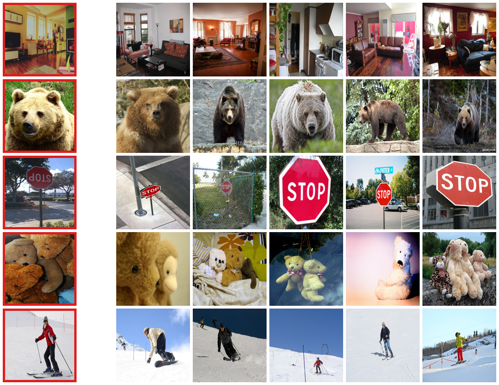
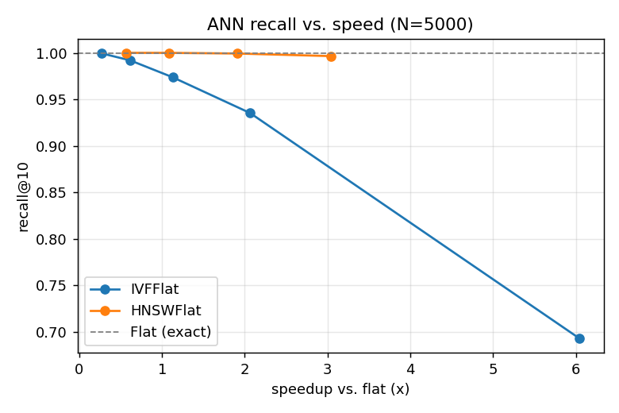

# CLIP Image Retrieval (COCO val2017)

Content-based **image search** over a ~5,000-image COCO val2017 slice, built on a
single CLIP backbone. It supports two query modes in one shared embedding space:

- **Image → image** — give a photo, get the most similar photos.
- **Text → image** — type a sentence, get matching photos.

Because CLIP's image and text encoders map into the *same* space, text search
reuses the exact same index as image search — no re-embedding, no rebuild.



*Image→image examples: the red-boxed query (left) and its top-5 nearest neighbors.
Rooms retrieve rooms, bears retrieve bears, stop signs retrieve stop signs.*

## How it works

```
COCO annotations ──build_manifest.py──▶ manifest.json      (paths, categories, captions)
val2017 images   ──embed_images.py────▶ embeddings.npy      (unit-norm CLIP vectors) + ids.json
embeddings.npy   ──build_index.py─────▶ index_flat.faiss    (IndexFlatIP = exact cosine)
query image/text ──search.py / search_text.py─▶ top-k results
```

**Backbone:** OpenCLIP `ViT-B/32` (`openai` weights), fixed throughout. Vectors are
L2-normalized, so inner product equals cosine similarity and FAISS `IndexFlatIP`
performs exact search — the correctness baseline for everything below.

## Results

### Image → image (leave-one-out, relevance = shared COCO category)

| Metric | Value |
|---|---|
| mAP | 0.553 |
| Precision@1 | 0.925 |
| Precision@5 | 0.906 |
| Precision@10 | 0.891 |
| Median rank of first relevant hit | 1 |

The top result shares a category with the query 92% of the time. mAP is lower
because it rewards ranking *all* relevant images high, which is hard when a
category like "person" has thousands of members.

### Text → image (query = each image's true caption, gold = that image)

| Metric | Value |
|---|---|
| Recall@1 | 0.290 |
| Recall@5 | 0.529 |
| Recall@10 | 0.628 |
| Median rank | 5 |
| Mean rank | 27.5 |

R@1 ≈ 0.29 matches published zero-shot CLIP ViT-B/32 numbers on COCO 5k. The
gap between median rank (5) and mean rank (27.5) reflects a right-skewed tail: most
queries land their image near the top, a minority land far down (see failures).

## ANN index: recall vs. speed

Exact flat search scans all vectors; approximate indexes (`IndexIVFFlat`,
`IndexHNSWFlat`) skip most of them, trading a little recall for speed.



| Index | recall@10 | speedup vs flat |
|---|---|---|
| Flat (exact) | 1.000 | 1.00× |
| IVFFlat nprobe=1 | 0.693 | 5.42× |
| IVFFlat nprobe=5 | 0.935 | 1.89× |
| HNSWFlat efSearch=16 | 0.997 | 2.97× |
| HNSWFlat efSearch=32 | 0.999 | 1.78× |

HNSW is the clear winner here — ~99.7% recall at ~3× speed. **Scale caveat:** at
N=5,000 the flat scan is already ~18 µs, so absolute speedups are small and noisy;
the tradeoff *shape* is what pays off at millions of vectors. Flat is kept as the
exact baseline. Full table in [`results/ann_metrics.md`](results/ann_metrics.md).

## Findings

**De-duplication.** Near-duplicates are trivial top hits that inflate metrics, so
we flag them (cosine > 0.98) and re-measure. COCO val2017 is essentially clean —
the highest similarity between any two different images is **0.98** (one pair) — so
our metrics are *not* propped up by duplicates. Details in
[`results/dedup_metrics.md`](results/dedup_metrics.md).

**Caption contamination (data-quality catch).** The downloaded caption set contains
**14 degenerate "captions"** — AI-assistant refusals and non-descriptions like
*"I am unable to see an image above."* Used as queries they carry no visual
information and pollute the metrics tail. `caption_utils.py` filters them out of
the text evaluation and failure analysis.

**Failure analysis — CLIP's compositional blind spots.** CLIP largely encodes a
"bag of concepts" and ignores word order, relations, and attribute binding:

- *Negation is not understood* — "a street with **no** cars" returns three images
  all containing cars; "a plate with food but **no** fork" returns a plate with a fork.
- *Attribute binding fails* — swapping colors barely changes the query or the
  results:

  | Query A | Query B | query cosine | top-10 overlap |
  |---|---|---|---|
  | a red car and a blue bus | a blue car and a red bus | 0.978 | 0.67 |
  | a white dog and a black cat | a black dog and a white cat | 0.988 | 0.67 |

  Cosine ≈ 0.98 and ~60% identical results mean CLIP can't tell the two apart.

Full write-up in [`results/failure_analysis.md`](results/failure_analysis.md).

## Limitations

- **Relevance is fuzzy.** Image→image "relevance" is COCO category overlap, which is
  multi-label — two images sharing only "person" count as a match even if they look
  nothing alike. Metrics are a consistent yardstick, not absolute truth.
- **Text→image recall undercounts.** One caption often fits many images, but only the
  source image is credited, so a valid alternative outranking it scores as a miss.
- **Possible pretraining exposure.** CLIP was trained on large web data and may have
  seen COCO-like images, making retrieval quality an optimistic estimate.
- **Compositionality.** As shown above, CLIP does not handle negation, counting, spatial
  relations, or attribute binding reliably.
- **Modality gap.** Text↔image cosine scores are absolutely lower than image↔image; only
  the ranking is meaningful, don't compare scores across modes.

## Repository layout

```
├── build_manifest.py  embed_images.py  build_index.py     # build the index
├── search.py  search_text.py                              # query (image / text)
├── evaluate.py  eval_text.py  dedup.py  bench_ann.py       # evaluation & studies
├── failure_analysis.py  caption_utils.py                  # failure analysis + caption filter
├── make_figures.py                                        # README figures
├── results/            # generated reports + figures/
└── app/                # Gradio demo (deployable to Hugging Face Spaces)
```

Derived artifacts (`embeddings.npy`, `ids.json`, `index_flat.faiss`, `manifest.json`)
and raw data (`val2017/`, `annotations/`) are gitignored — regenerate them with the
pipeline below.

## Setup & run

```bash
python -m venv cvenv && source cvenv/bin/activate
pip install -r requirements.txt
# place COCO val2017 images in val2017/ and annotations in annotations/

python build_manifest.py        # -> manifest.json
python embed_images.py          # -> embeddings.npy + ids.json  (first run downloads weights)
python build_index.py           # -> index_flat.faiss

python search.py --id 139 -k 5                     # image -> image (by dataset id)
python search.py --image path/to/photo.jpg -k 5    # image -> image (any image)
python search_text.py "a dog playing in the snow"  # text -> image

python evaluate.py              # image->image metrics  -> results/metrics.md
python eval_text.py             # text->image metrics   -> results/text_metrics.md
python dedup.py                 # dedup study           -> results/dedup_metrics.md
python bench_ann.py             # ANN benchmark         -> results/ann_metrics.md
python failure_analysis.py      # failure cases         -> results/failure_analysis.md
python make_figures.py          # -> results/figures/*.png   (needs matplotlib)
```

Search uses numpy exact cosine over `embeddings.npy` (identical to `IndexFlatIP`); this
keeps FAISS out of the same process as PyTorch, which avoids an OpenMP crash on macOS.

## Demo

`app/app.py` is a Gradio interface with both query modes, deployable to Hugging Face
Spaces. Result images are fetched server-side from the COCO CDN, so the Space ships only
`embeddings.npy` + `ids.json`, not the images.

```bash
cd app && pip install -r requirements.txt && python app.py
```
